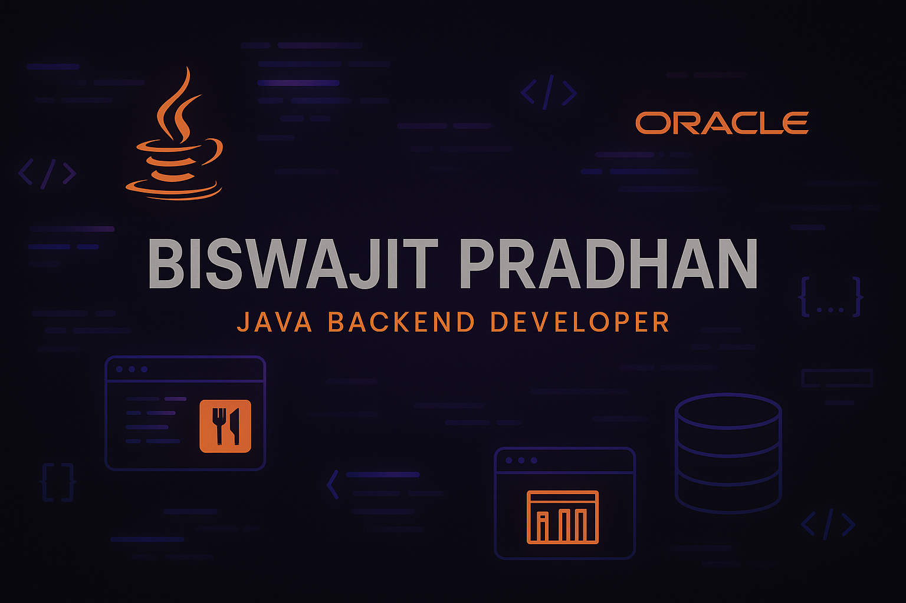

<h1 align="center">Hi 👋, I'm Biswajit Pradhan</h1>
<h3 align="center">Java Backend Developer | B.Tech CSE 2025 | Bhubaneswar</h3>

  
  
  

---

### 😎 About Me

💡 A dedicated Java backend developer with a passion for building reliable systems  
🌱 Currently mastering **Spring Boot** and **ReactJS** for full-stack projects  
🔭 Completed JDBC, Servlet, and Oracle DB applications  
🎯 Eager to step into backend roles and real-world development environments

---

### 🔥 Core Beliefs

- 🚀 Daily learning is my mantra
- 🧠 I value clean code and logical problem-solving
- 🌍 Open to internships, freelance, and open-source work
---

### 🛠️ Languages & Tools

  
  
  
  
  
  
  

